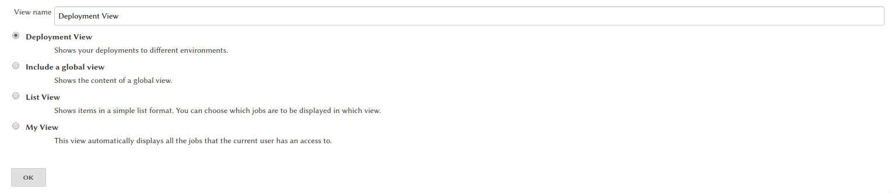
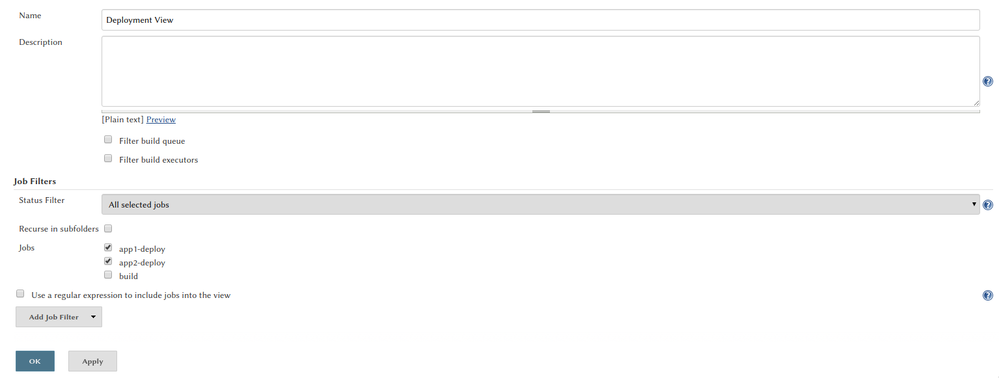
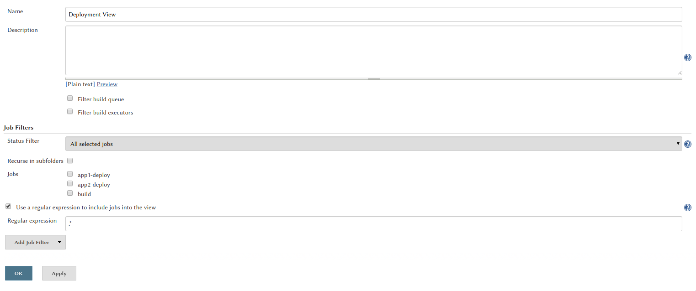
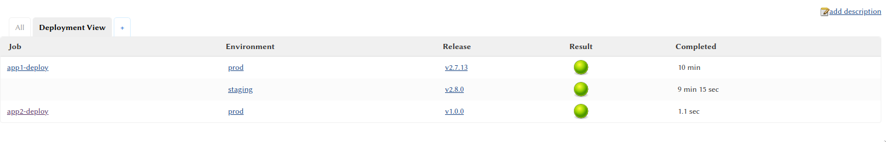
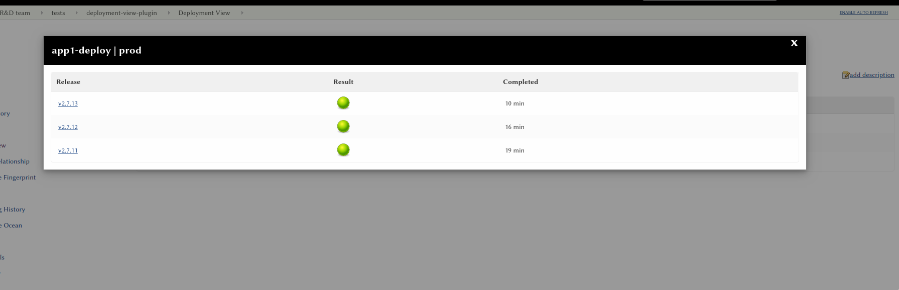
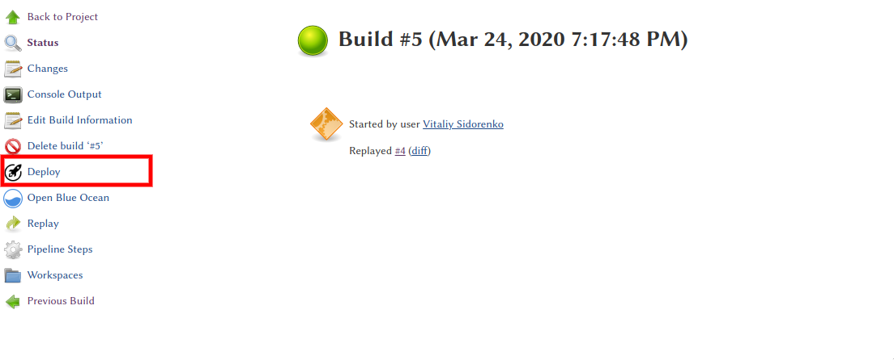

# Jenkins Deploy Dashboard Plugin

#### Overview

This Jenkins plugin creates a custom view which can be used as a dashboard to display what code release versions have been deployed to what test and production environments (or devices).


## Deployment View 
#### Add new view

On the Jenkins main page or folder, click the + tab to start the new view wizard (If you
do not see a +, it is likely you do not have permission to create a new view). 
On the create new view page, give your view a name and select the Dashboard
type and click ok.




Select the list of jobs to include in the view. This is exactly the
same process as the standard list view that comes with Jenkins.



Also a regular expression can be used to specify the jobs to include in
the view. (e.g.: `.*` will select all the jobs int the folder)



#### How it looks like



You can click on the specific environment and get the release history




#### Pipeline | Add a new release to the environment
```groovy
properties([parameters([
    string(name: 'version', description: 'App version to deploy'),
    choice(name: 'env', choices: ['dev', 'prod'], description: 'Envirement where the app should be deployed')
])])

node {
    stage("Deploy") {
        // Deploy app version ${params.version} to ${params.env} environment
        
        //add release information to dashboard
        addDeployToDashboard(env: params.env, buildNumber: params.version)
    }
}
```


## Add action button feature
There is one more useful feature which this plugin can do. You can add the additional buttons to the build sidebar.
This feature doesn't have any binding with Deploy Dashboard feature, it's just comfortable to use them together.

#### Pipeline | Add button
E.g.: We are building an app and add the the button which will link to deployment job
```groovy
node {
    stage("Build") {
        String builtVersion = "v2.7.5"
        // Build app with ${builtVersion} version

        //Add buttons to the left sidebar
        buildAddUrl(title: 'Deploy to DEV', url: "/job/app-deploy/parambuild/?env=dev&version=${builtVersion}")
        buildAddUrl(title: 'Deploy to PROD', url: "/job/app-deploy/parambuild/?env=prod&version=${builtVersion}")
    }
}
```
#### How it looks like




## License

This plugin is licensed under the Apache license 2.0, see [LICENSE](LICENSE).

## TODO

- Make the Deploy Dashboard work with Multibranch jobs

