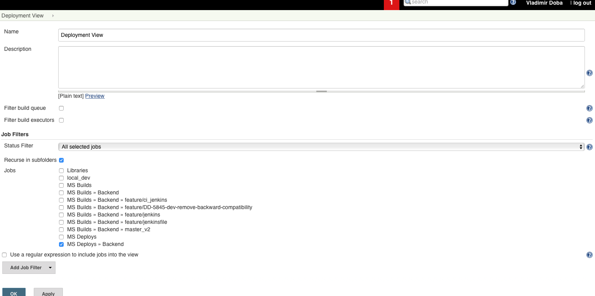
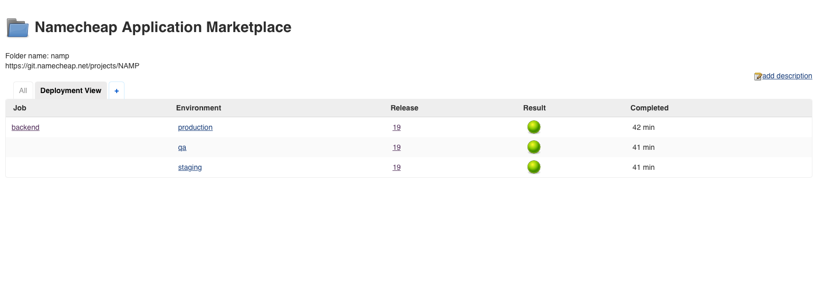
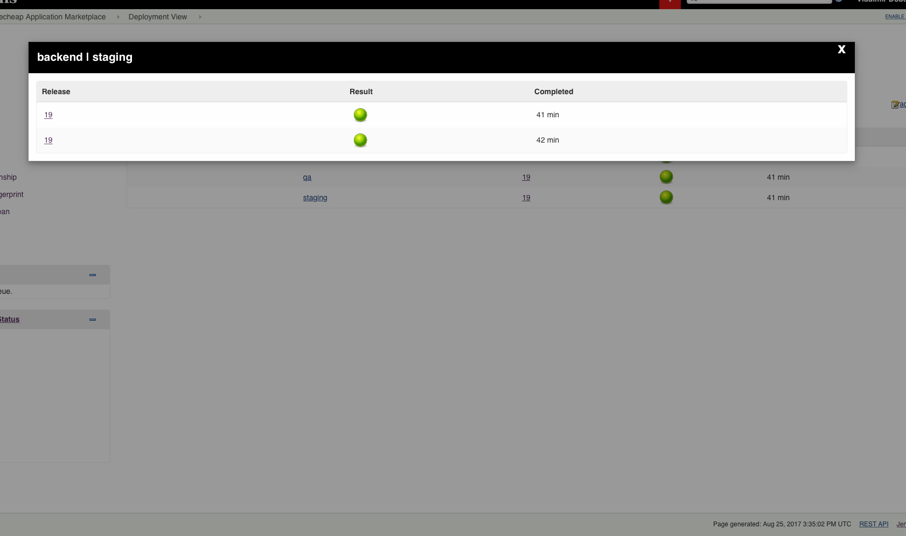
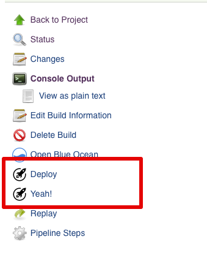

Jenkins Dashboard Plugin
=========================

This Jenkins plugin creates a custom view which can be used as a dashboard to display what code release versions have been deployed to what test and production environments (or devices).







## Pipeline
```groovy
node {
  stage("deploy") {
    deployment(env: "staging", buildNumber: "${GIT_COMMIT}-${env.BUILD_ID}")
    // ...
  }
}

```

## AddAction
Add action to build sidebar.


```groovy
node {
    stage("Build") {
        buildAddUrl(title: 'Deploy', url: "/template/${env.BUILD_ID}")
        buildAddUrl(title: 'Yeah!', url: "/yeah/${env.BUILD_ID}")
    }
}
```